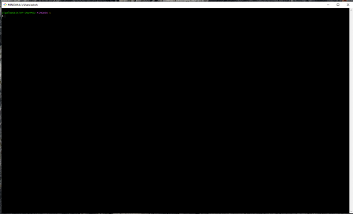

# Git newbee manual by @Selge.

Well, this is just a short GIT-newbee manual. 

## Git basics:

How to start working with Git? First you need to create a Git account on one of Git web services: GitHub, GitLab etc. You need to understand that **git** itself is only a version control software, and different internet sites are services that providing you access to git servers.

For the moment GitHub is the world's most popular Git service and I do recommend to start using it if you're a git-beginner. GitHub has its own Wiki, proposes a lot of additional services and features, it's easy to use and enjoy. To create an account please visit: https://github.com/
aaaand you should see this page:

_GitHub start page_

## Git installation:

First make sure you've created a Git account (please look above for help).
After creating an account, download and install required Git version please follow the link:

https://git-scm.com/

_Git officlial page_

From my point of view it's much more useful for a programmer to use GitBash shell, but you may as well try one of Git GUI (graphical user interface) desktop apps.

You may use standart desktop Git GUI application:

_Git GUI window_

But if you surely want to use GUI application, I do recommend GitHub desktop:

_Github desktop window_

If you use the GitBash (as I recommend) just start the GitBash.app and just type the commands in the window:

_GitBash shell window_

## Git commands:

***First let's check if Git is installed:***

**git --version** - shows (if Git is installed to your OS) current program version

***Then let's introduce yourself to Git:***

**git config --global user.name "Username Usersurname"** - Your Name

**git config --global user.email "username@isegal.de"** - Your e-mail address

***After that use the commang you currently need:***

**E:/Whatever/TestGitFolder/Whatever_2 git init** - creating a new repository from an any existing directory

## Git in daily use:

**git clone <here we get URL of the required repository** - cloning ***all*** the repository, including all the existing branches *and the same time trying to merge all of them*

**git pull** - use this to clone the repository you need to your local PC to start coding (and commiting)

**git status** - checking current git repository status (checks if files in your local project are updated with the target repository)

### What is Git branches about?

_Git branch system was designed to test different options on the same code snippets or to merge together different files to craft the final product._

**git branch** - checking all the branches in the current repository and shows you where you are

**git checkout ***branchname***** - swaping between the branches, where ***branchname*** is the branch you need to start working with

**git checkout -b ***branchname***** - if you need to create new branch and switch to it

**git checkout -d ***branchname***** - deleting branch

### Daily commiting

**git add** - adding file/files to the next commit

**git log** - showing commit history

**git log graph** - commit history with a kinda graphical interface

**git diff** - showing difference between actual and commited file/files

**git commit -m "message"** - creating new commit. "message" is adding a small comment so you understand what's changed

**git push** - this commands updates your git repository with the latest changes made by you

**pull request** - request to merge your current branch with the target project branch

**git merge** - merging your changes

### Undoing your changes:

**git checkout ***commit***** - turn your changes back to the commit # "commitname"

**git revert** - creating a new commit, the changes will be updated according to the commit # "commitname"

**git reset ***commit***** - reset your commit history back to the commit # "commitname"

**git commit --amend** - cancel your latest commit

**git clean** - cancelling changes in the local PC directory

### Thank you for your attention!
